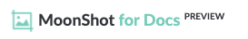
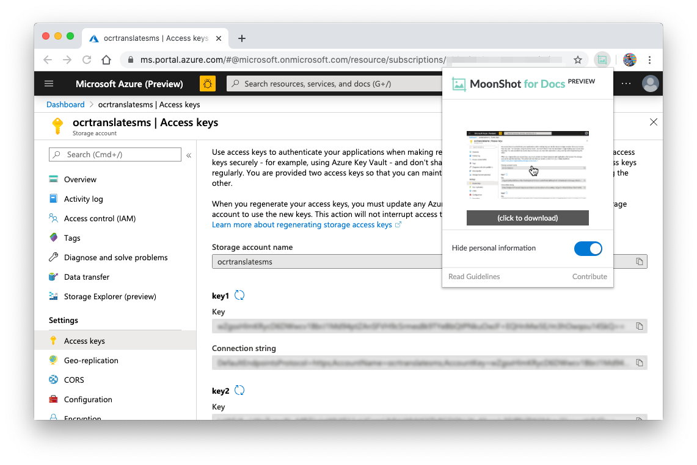

    

## What is MoonShot?

MoonShot is a browser extension to capture screenshots in-browser, and hide personal and sensitive information.

Current supported targets are:
- GitHub (https://github.com/)
- Microsoft Azure portal (https://ms.portal.azure.com/)
- Microsoft Docs (https://docs.microsoft.com/) 

## How to install the extension

1. Clone this repository to your computer.
1. Go to [chrome://extensions/](chrome://extensions/) or [edge://extensions](edge://extensions) and check the box for **Developer mode**.
1. Go back to the [chrome://extensions/](chrome://extensions/) or [edge://extensions](edge://extensions) page and click the **Load unpacked** extension button and select the folder for your extension to install it.
